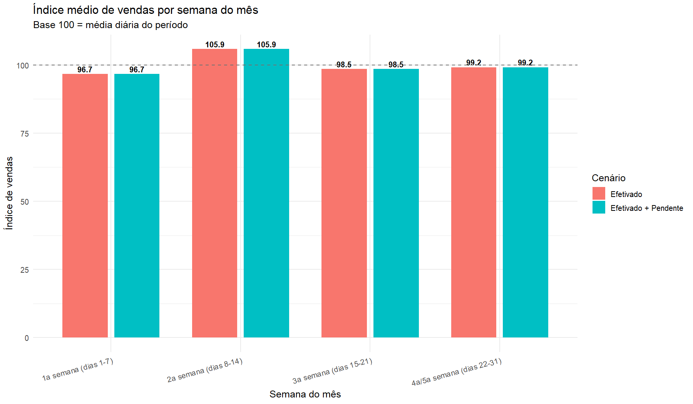
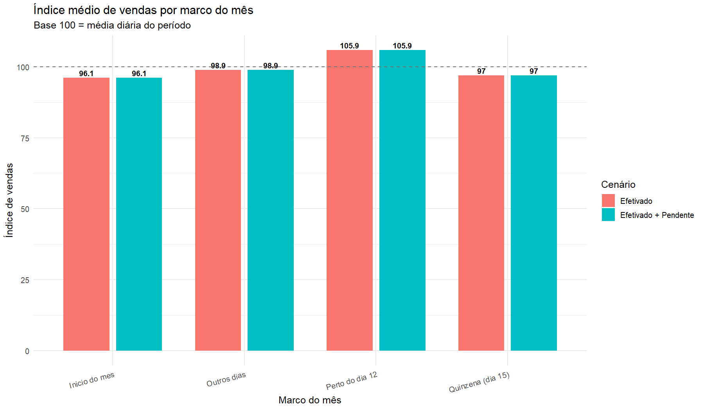
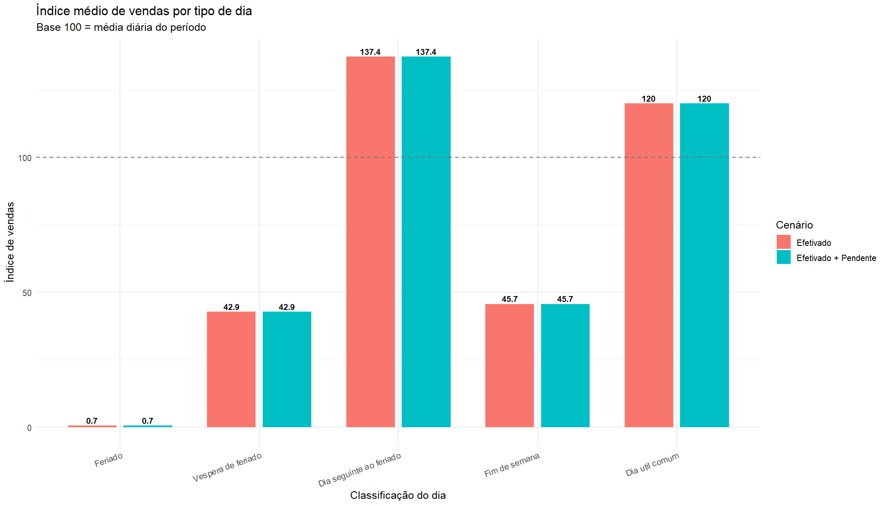
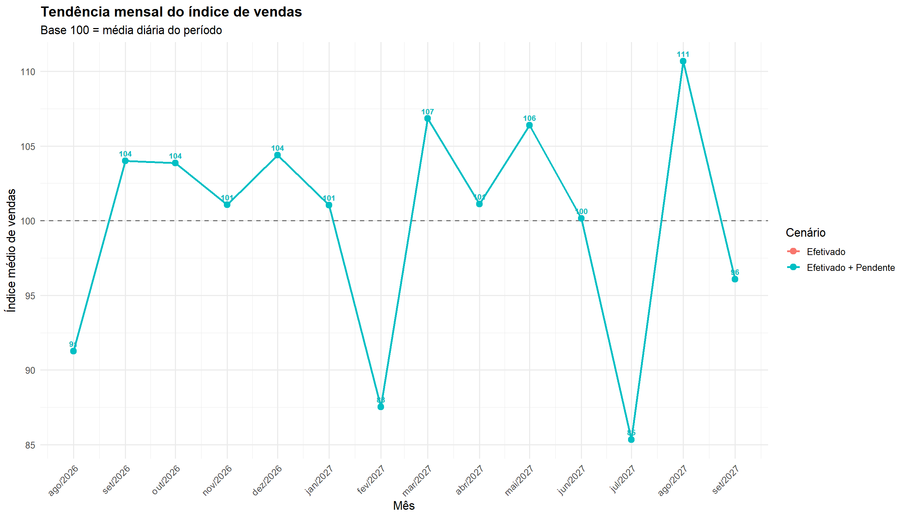
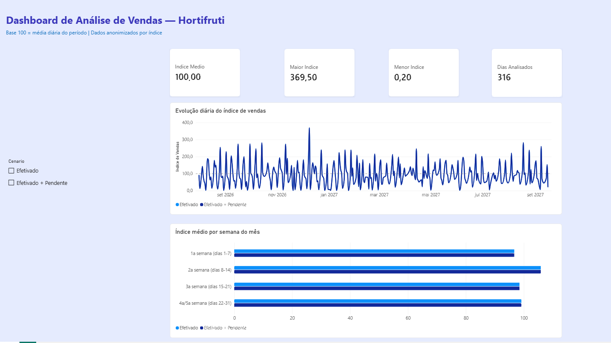

# Análise de Vendas de Hortifruti

[](https://www.r-project.org/)
[](https://www.python.org/)
[](https://pandas.pydata.org/)
[](https://ggplot2.tidyverse.org/)

Projeto de análise de dados desenvolvido em **Python e R** para identificar padrões de vendas, sazonalidade, impacto de feriados e oportunidades de planejamento de estoque em uma operação de hortifruti com loja física e delivery.

> **Privacidade:** os dados publicados foram agregados por dia e anonimizados. O repositório não disponibiliza registros individuais, valores financeiros reais, horários, clientes, identificadores de pedidos ou informações da operação original.

---

## Contexto

Operações de hortifruti trabalham com produtos de alta perecibilidade e demanda variável. Uma compra insuficiente pode causar ruptura de estoque; uma compra excessiva pode gerar perdas e descarte.

Este projeto transforma registros brutos de caixa em indicadores que ajudam a responder perguntas como:

- Qual semana do mês costuma concentrar maior movimento?
- O pico está relacionado ao dia 12, à quinzena ou a uma janela de reposição?
- Como feriados, vésperas e dias posteriores ao feriado afetam o índice de vendas?
- Quais períodos sazonais merecem maior atenção de estoque?
- Como gerar uma projeção relativa de demanda para períodos sazonais?

---

## Principais insights

A análise identificou padrões que podem apoiar decisões de compra e reposição:

- A **segunda semana do mês**, entre os dias 8 e 14, apresentou o maior índice médio de vendas no histórico analisado.
- O **dia 12 isolado não explica o pico**; o comportamento é mais consistente quando observado como uma janela de dias dentro da segunda semana.
- Feriados e vésperas tendem a alterar o padrão de vendas, enquanto o retorno após o feriado pode concentrar demanda de reposição.
- A análise foi pensada para apoiar uma operação de produtos perecíveis, em que disponibilidade, giro, sazonalidade e risco de perda precisam ser considerados juntos.
- A versão pública usa índices relativos: **100 representa a média diária do período**. Valores acima de 100 indicam desempenho acima da média; abaixo de 100, desempenho abaixo da média.

---

## Pipeline de dados

```text
TXT bruto privado
      │
      ▼
Python: conversão TXT → CSV estruturado
      │
      ▼
CSV detalhado privado
      │
      ▼
Python: agregação diária e anonimização por índice
      │
      ▼
CSV público sem valores reais
      │
      ▼
R: análise de semana, calendário, sazonalidade e projeção
      │
      ▼
Tabelas e gráficos em índice de vendas
```

---

## Tecnologias utilizadas

| Tecnologia | Uso no projeto |
|---|---|
| Python | Conversão do extrato TXT e anonimização da base |
| pandas | Limpeza, transformação e agregação diária dos dados |
| R | Análises estatísticas e geração dos outputs |
| dplyr | Manipulação e sumarização de dados em R |
| ggplot2 | Criação de gráficos de índice de vendas |
| lubridate | Tratamento de datas, semanas, meses e calendário |
| readr | Leitura e escrita de arquivos CSV |
| tidyr | Transformação de dados entre formatos largo e longo |

---

## Estrutura do projeto

```text
analise-hortifruti/
│
├── data/
│   ├── processed/
│   │   └── vendas_diarias_indice.csv
│   └── raw/
│       └── README.md
│
├── scripts/
│   ├── 00_converter_txt_para_csv.py
│   ├── 01_anonimizar_por_indice.py
│   ├── 02_analise_semana_do_mes.r
│   ├── 03_analise_feriados.r
│   ├── 04_analise_fim_de_ano.R
│   └── 05_resumo_executivo.R
│
├── outputs/
│   ├── figures/
│   └── tables/
│
├── docs/
│   ├── dicionario_de_dados.md
│   └── metodologia.md
│
├── .gitignore
├── requirements.txt
└── README.md
```

---

## Dados e anonimização

A base de dados original é privada e não faz parte deste repositório.

Para proteger a operação analisada, o processo público aplica as seguintes medidas:

- Agregação dos movimentos por dia.
- Remoção de horário, histórico do caixa e identificadores individuais.
- Remoção de dados de clientes e pedidos.
- Deslocamento das datas.
- Remoção de valores em reais e de quantidades de pedidos.
- Conversão do faturamento em índice relativo de vendas.

A base pública possui apenas estas colunas:

| Coluna | Descrição |
|---|---|
| `data` | Data anonimizada e deslocada |
| `indice_vendas_efetivadas` | Índice de vendas concluídas; base 100 = média diária |
| `indice_vendas_com_pendente` | Índice de vendas concluídas + pendentes; base 100 = média diária |

> Os resultados públicos representam padrões analíticos, não valores financeiros reais da operação.

---

## Como executar

### Pré-requisitos

- Python 3.10 ou superior.
- R 4.2 ou superior.
- RStudio recomendado.

### 1. Clonar o repositório

```bash
git clone https://github.com/nadiaoliveira22/analise-hortifruti.git
cd analise-hortifruti
```

### 2. Instalar dependências Python

```bash
python -m pip install -r requirements.txt
```

### 3. Instalar pacotes R

No RStudio, execute:

```r
install.packages(c(
  "dplyr",
  "ggplot2",
  "lubridate",
  "readr",
  "tidyr"
))
```

### 4. Executar as análises R

A base pública por índice já está disponível em `data/processed/`. No RStudio, execute os scripts abaixo a partir da raiz do projeto:

```r
source("scripts/02_analise_semana_do_mes.r")
source("scripts/03_analise_feriados.r")
source("scripts/04_analise_fim_de_ano.R")
source("scripts/05_resumo_executivo.R")
```

Os resultados serão salvos em:

```text
outputs/figures/
outputs/tables/
```

### Fluxo privado opcional

Os scripts Python abaixo existem para demonstrar o pipeline completo, mas exigem uma base privada local que **não está incluída neste repositório**:

```bash
python scripts/00_converter_txt_para_csv.py
python scripts/01_anonimizar_por_indice.py
```

---
## Dashboard no Power BI

O projeto inclui um modelo de dashboard desenvolvido no Power BI para acompanhar o comportamento do índice de vendas.

Principais elementos do painel:

- Evolução diária do índice de vendas;
- Comparação entre os cenários “Efetivado” e “Efetivado + Pendente”;
- Índice médio por semana do mês;
- Indicadores de índice médio, maior índice, menor índice e dias analisados.

> O dashboard utiliza dados anonimizados por índice. A base 100 representa a média diária do período, sem exposição de valores financeiros reais.

### Como abrir

1. Baixe o arquivo `powerbi/analise_hortifruti_dashboard.pbit`;
2. Abra-o no Power BI Desktop;
3. Quando solicitado, selecione o arquivo público `data/processed/vendas_diarias_indice.csv`.
---

## Resultados visuais

### Índice por semana do mês

> 

### Índice por marco do mês

> 

### Índice por tipo de dia
> 

### Tendência mensal
> 

### Projeção sazonal relativa

> 

### Power BI

> 

---

## Limitações

- Os dados públicos foram transformados para proteger a confidencialidade da operação.
- A base pública não diferencia loja física, WhatsApp, iFood ou entrega própria.
- O índice de vendas não substitui uma análise de quantidade vendida em quilos ou unidades.
- Não há registro público de estoque, ruptura, descarte, promoções, clima ou eventos locais.
- Projeções sazonais devem ser atualizadas à medida que novos ciclos de dados se tornam disponíveis.

---

## Aprendizados demonstrados

Este projeto demonstra competências em:

- Limpeza e estruturação de dados brutos em TXT.
- Construção de um pipeline híbrido com Python e R.
- Anonimização e publicação responsável de dados de negócio.
- Análise exploratória de dados e sazonalidade.
- Agregação de métricas diárias e análise temporal.
- Construção de visualizações com `ggplot2`.
- Análise de efeitos de calendário e períodos sazonais.
- Documentação técnica e organização de repositórios.
- Tradução de dados em recomendações para estoque e operação.

---

## Autora

**Nádia Oliveira**  
Estudante de Análise e Desenvolvimento de Sistemas  
[GitHub](https://github.com/nadiaoliveira22)
